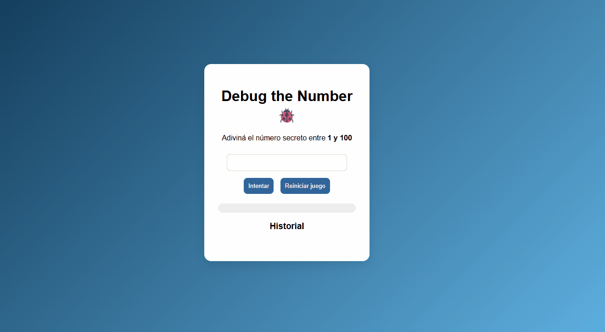

# 🎯 numFounder

> Un mini juego interactivo donde tu objetivo es descubrir el número secreto entre 1 y 100 utilizando pistas, estrategia y un poco de intuición.

## 📌 Descripción

**numFounder** es un juego de adivinanza de números desarrollado como proyecto personal.

El desafío consiste en encontrar un número secreto generado aleatoriamente entre **1 y 100**. Cada intento realizado recibe una pista que indica qué tan cerca o lejos se encuentra el jugador del número correcto.

Además de las pistas de texto, el juego incorpora indicadores visuales para hacer la experiencia más dinámica e intuitiva.

## 🎮 Cómo jugar

1. Ingresá un número entre 1 y 100.
2. Recibí una pista según qué tan cerca estés del número secreto.
3. Ajustá tu estrategia con cada intento.
4. Encontrá el número correcto intentando utilizar la menor cantidad de intentos posible.

## ✨ Características

* 🔢 Generación aleatoria del número secreto.
  
* 💡 Sistema de pistas según proximidad:
  * Mensajes indicando si hay que buscar un número más grande o más chico.
  * Mensajes con tono humorístico para acompañar la experiencia.
    
* 📊 Barra de progreso de cercanía:
  * 🔴 Rojo cuando el número está lejos.
  * 🟠 Amarillo/naranja cuando hay una distancia intermedia.
  * 🟢 Verde cuando el jugador está cerca del objetivo.
    
* 📝 Historial de intentos realizados.
  
* 🔢 Contador de cantidad de intentos.
  
* 🎨 Interfaz enfocada en brindar feedback visual al jugador.

## 🖥️ Capturas

## 🛠️ Tecnologías utilizadas

* HTML
* CSS
* JavaScript

## 🚀 Instalación y ejecución

Descargar repositorio y abrir el archivo index en el navegador.

## 📚 Aprendizajes

Durante el desarrollo de este proyecto practiqué:

* Manipulación de elementos de interfaz.
* Manejo de eventos del usuario.
* Lógica de programación aplicada a un juego.
* Creación de sistemas de feedback visual.
* Organización y estructura de un proyecto frontend.

## 👩‍💻 Autora

**Ximena Hernández**

Proyecto desarrollado como práctica personal de programación.
